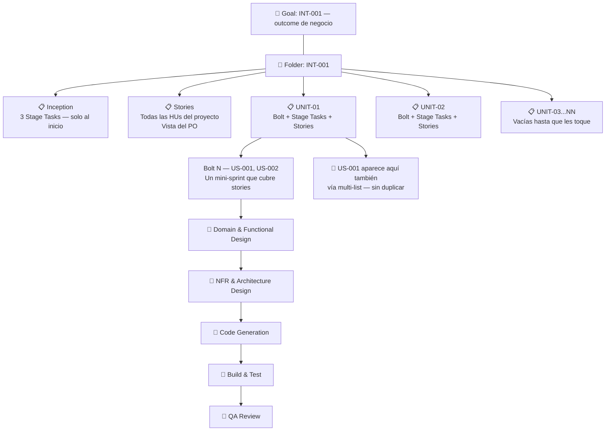
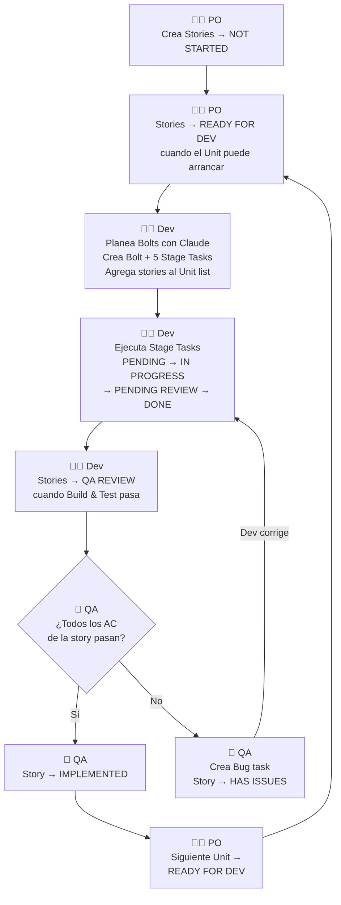

# AI-DLC en ClickUp — Guía por Rol

> Qué hace cada persona en ClickUp, cuándo y cómo. Sin teoría — solo pasos concretos.

---

## Cómo está organizado en ClickUp



---

## Cómo fluye el trabajo entre roles



---

## PO (Product Owner)

### Setup — una vez por Intent

1. Crear **Goal** en ClickUp → nombre: `INT-NNN: [Outcome de negocio]`
2. Crear **folder** `INT-NNN` dentro del Space correspondiente
3. Crear lista **Inception** → agregar 3 Stage Tasks → aplicar template `ai-dlc-task-flow`
4. Crear lista **Stories** → agregar todas las HUs con AC como checklists → aplicar template `ai-dlc-stories`
5. Crear listas **UNIT-01 → UNIT-NN** (vacías) → aplicar template `ai-dlc-task-flow` a cada una
6. Configurar **Dependencies** entre Unit lists según el dependency matrix del repo

### Rutina — cuando hay un Unit activo

| Cuándo | Qué hacer |
|--------|-----------|
| El dev arranca un Unit | Verificar que las stories de ese Unit están en `READY FOR DEV` |
| Aparece una story en `QA REVIEW` | Abrir la story → revisar AC checklist → mover a `IMPLEMENTED` o `HAS ISSUES` |
| Todas las stories de un Unit → `IMPLEMENTED` | Mover las stories del siguiente Unit a `READY FOR DEV` |
| Cualquier momento | Revisar el **Goal** para ver el progreso general (stories X/N) |

### Lo que el PO NO hace

- No crea Bolts ni Stage Tasks — eso es el dev
- No toca `aidlc-docs/` — el repo es del dev
- No valida código — valida comportamiento desde perspectiva de usuario (AC)

---

## Dev

### Al arrancar un Unit

1. Con Claude, planear cuántos Bolts necesita el Unit y qué stories cubre cada uno
2. En el Unit list: crear **Bolt task** → nombre: `Bolt N — US-NNN, US-NNN`
3. Dentro del Bolt: crear los **5 Stage Tasks** como subtasks:
   - Domain & Functional Design
   - NFR & Architecture Design
   - Code Generation
   - Build & Test
   - QA Review
4. Agregar las stories del Bolt al Unit list via **Add to multiple lists**
5. Mover esas stories a `IN DEVELOPMENT`

### Durante el Bolt — secuencia de Stage Tasks

Cada Stage Task sigue el mismo ciclo:

```
PENDING → IN PROGRESS → PENDING REVIEW → DONE
```

| Stage Task | Cuándo mover a IN PROGRESS | Cuándo mover a PENDING REVIEW | Cuándo mover a DONE |
|------------|---------------------------|-------------------------------|---------------------|
| Domain & Functional Design | Al arrancar el diseño con Claude | Claude generó el artefacto, hay que revisarlo | PO/Dev aprobó el diseño |
| NFR & Architecture Design | Al arrancar NFRs con Claude | Claude generó NFRs y ADRs, hay que revisarlos | Dev aprobó la arquitectura |
| Code Generation | Al empezar a generar código | Código generado, dev revisando | Dev aprobó el código |
| Build & Test | Al ejecutar tests | Tests corriendo, pendiente resultado | Tests pasando ✅ |
| QA Review | QA abrió la story | — | QA aprobó todas las stories del Bolt |

### Handoff a QA

Cuando **Build & Test → DONE**:
1. Mover cada story del Bolt a `QA REVIEW` en la lista Stories
2. Avisar a QA que las stories están listas para validar

### Si QA devuelve una story con `HAS ISSUES`

1. Revisar el Bug task que creó QA
2. Corregir
3. Volver a ejecutar Build & Test
4. Mover la story de vuelta a `QA REVIEW`

### Lo que el dev NO hace

- No mueve stories a `IMPLEMENTED` — eso es QA
- No crea Goals ni folders — eso es el PO
- No escribe en ClickUp lo que ya está en `aidlc-state.md`

---

## QA

### Cuándo entra QA

Cuando una story aparece en `QA REVIEW` en la lista **Stories**.

### Qué hacer por cada story

1. Abrir la story task
2. Ir AC por AC en el checklist
3. Validar el comportamiento desde perspectiva de usuario (no revisar código)

| Resultado | Acción |
|-----------|--------|
| Todos los AC pasan ✅ | Mover story a `IMPLEMENTED` |
| Algún AC falla ❌ | Crear task tipo **Bug** en el Unit list → mover story a `HAS ISSUES` |

### Cómo crear un Bug task

- Crear en el Unit list activo
- Nombre: `[Bug] [Descripción concisa del problema]`
- Incluir: qué AC falló, cómo reproducirlo, qué se esperaba vs qué pasó
- Severity: Critical / High / Medium / Low

### Lo que QA NO hace

- No revisa código — Build & Test ya validó eso
- No actualiza Stage Tasks — eso es el dev
- No toca `aidlc-docs/`

---

## Resumen de handoffs

```
PO crea Stories (NOT STARTED)
    ↓
PO mueve a READY FOR DEV cuando el Unit puede arrancar
    ↓
Dev arranca Unit → crea Bolt → mueve stories a IN DEVELOPMENT
    ↓
Dev termina Build & Test → mueve stories a QA REVIEW
    ↓
QA valida AC
    ↓
    ├── Todo bien → IMPLEMENTED → PO ve el progreso en el Goal
    └── Algo falla → HAS ISSUES → Dev corrige → vuelve a QA REVIEW
```

---

## Dónde mira cada uno

| Pregunta | Quién | Dónde en ClickUp |
|----------|-------|-----------------|
| ¿Qué stories están listas para validar? | QA | Lista `Stories` → filtrar por `QA REVIEW` |
| ¿Cuánto falta del proyecto? | PO | Goal → progress targets |
| ¿En qué Bolt estamos? | Dev / PO | Lista `UNIT-XX` activo → Bolt en `IN PROGRESS` |
| ¿Qué AC faltan de una story? | QA / PO | Story task → checklist |
| ¿Qué está bloqueando el avance? | PO | Lista Stories → filtrar por `HAS ISSUES` |
| ¿Qué Stage Task sigue? | Dev | Unit list → Bolt activo → próximo subtask en `PENDING` |
